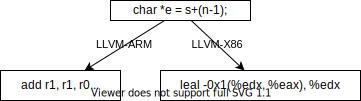
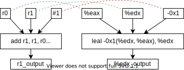

% 二进制翻译&算法
% 谢本壹 2022年3月22日
% 微处理器研究中心

# 背景介绍

## 研究领域

微处理器研究中心@龙芯

* 系统软件设计🤓
* ...
* 芯片物理设计

偏工程实现的课题组

## 研究对象

二进制翻译



* 被翻译平台(arm) : 客户(guest)
* 翻译平台(x86)   : 宿主(host)

## 核心内容

arm机器指令 => x86机器指令

* add r1, r1, r0 => addl %eax, %edx
* sub r1, r1, #1 => subl $0x1, %edx

## 报告来源

* 2018
* 《Enhancing Cross-ISA DBT Through Automatically Learned Translation Rules》
* Wenwen Wang
* ASPLOS
* Citations: 15

# 基于学习的翻译

## 现状

一对多翻译

* 一条guest指令
* 多条中间指令
* 优化
* 多条host指令

## 问题

指令膨胀

* 算逻指令：1x
* 访存指令：10~100x

效率不高

## 优化方案

多对多翻译

利用编译器建立映射



## 挑战

如何验证语义相同？

# 语义验证

## 映射操作数

基于经验

* 只考虑同类型操作数（共3类，寄存器、内存、立即数）
* 立即数配合算术逻辑运算
* 一个寄存器至多映射映射一次



## 符号执行

简化版（忽略位长）

```
r1_output  = r0 + r1 - 1
edx_output = eax + edx + (-1)
```


## 求解

```
∀ x,y ∈ int32
┌─r0 = eax = x
├─r1 = edx = y
└─r0 + r1 -1 = eax + edx + (-1)
```

若成立，则学习到一条翻译规则

# 求解方法

## SMT

求解公式是否可满足的问题

Satisfiability Modulo Theories (SMT)

```
∀ x,y ∈ int32
┌─r0 = eax = x
├─r1 = edx = y
└─r0 + r1 -1 = eax + edx + (-1)
```

## SMT解法

整数计算退化布尔逻辑（决策问题）

* Satisfiability Modulo Theories (SMT)
  * 整数, np-hard
* boolean SATisfiability problem (SAT)
  * 布尔, np-complete

## SAT解法

* 与、或、非、蕴含、括号的逻辑公式可转换为
* 合取范式（Conjunctive normal form，CNF）

$$
(a\lor b \lor \neg c)\land
(\neg d \lor e \lor \neg f \lor g) \land
(\neg h \lor i \lor j)\land \dots \land
(k \lor l \lor \neg m)
$$

* DPLL算法求解
  * 剪枝+深度优先

## SMT求解器

比如

* Z3 @microsoft
* CVC
* ...

描述SMT问题的语言标准：SMT-LIB

每年SMT-COMP比赛

# 谢谢

## 二进制翻译&算法

谢本壹🤓

2022年3月22日

微处理器研究中心

## 后记

选课理由

* 转换思维、看看别的领域同学

学习收获

* 12份笔记

启发

* 纯工程难，借鉴其他学科的知识会不会有创新？
